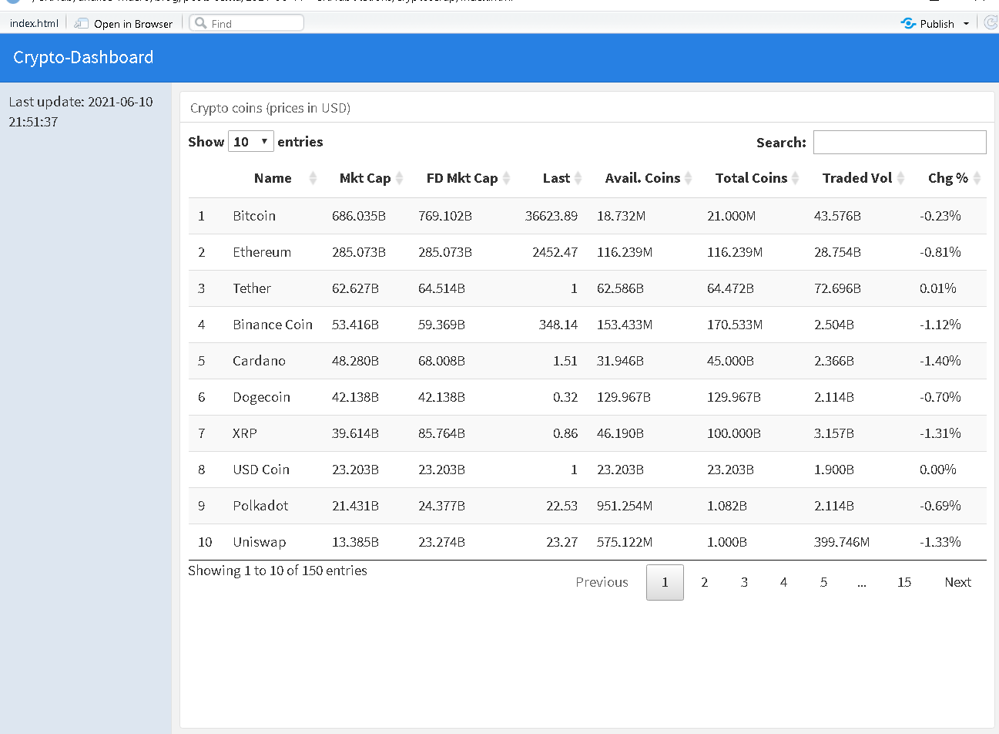

# crypto_scrap

Small dashboard to showcase the use of **workflow (R scripts) automation with GitHub Actions**. Access the dashboard through [this link](https://fortietwo.com/crypto_scrap/).

# Application

In this example, we create an R script for web-scrapping cryptocurrencies prices on the [TradingView](https://www.tradingview.com/markets/cryptocurrencies/prices-all/) website, we generate a basic view of the data in a dashboard and we automate the update every 1 hour with GitHub Actions.

A tutorial (in Portuguese) about this example can be found at [this link](https://analisemacro.com.br/data-science/como-automatizar-scripts-de-r-usando-o-github-actions/).
 
# Disclaimer 

As mentioned, this is a small showcase example of using GitHub Actions to eliminate manual work, and it certainly doesn't cover all the possibilities or robustness needed to avoid errors in the workflow. I recommend checking the documentation for the tools and packages used here to get deeper into the topic.
